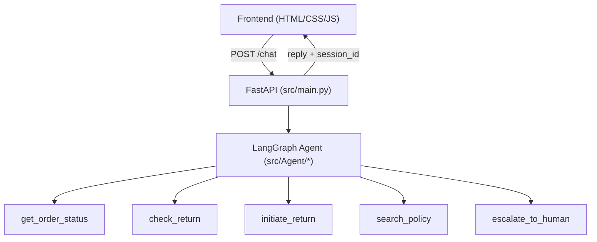

# Trendly Support Assistant

An AI-powered customer support agent for **Trendly**, a fashion e-commerce
brand. Built with a LangGraph multi-tool agent, a FastAPI backend, and a
lightweight vanilla JS/HTML/CSS frontend — handles order tracking, returns,
refunds, and policy questions, with human escalation when it's out of its
depth.

## Features

- **Conversational order support** — track orders, check return eligibility,
  initiate returns, and check refund status through natural language.
- **Policy Q&A via RAG** — answers grounded in Trendly's actual return/refund
  policy document, retrieved with a FAISS vector store rather than
  hallucinated.
- **Human escalation** — the agent recognizes when a query needs a live
  agent and hands off instead of guessing and send the details through email API.
- **Multi-turn memory via LangGraph checkpointing** — conversations are
  tracked per session using LangGraph's `MemorySaver` checkpointer, keyed by
  `thread_id` (mapped 1:1 to the API's `session_id`). This means the agent
  remembers earlier context within a session — e.g. an order ID mentioned
  two messages ago — without the client needing to resend the full history
  on every request. Note: history is in-memory, so it resets whenever the
  server restarts; it isn't persisted to disk.
- **Evaluated, not just vibes-checked** — see [Evaluation](#evaluation)
  below.

## Architecture



- **LLM**: Groq (`llama-3.3-70b-versatile`) via `langchain-groq`.
- **Agent orchestration**: LangGraph, with per-session conversation state
  handled by LangGraph's `MemorySaver` checkpointer, keyed by `thread_id`
  (so the API's `session_id` maps directly onto LangGraph's checkpointing).
  This is in-memory only — state doesn't survive a server restart.
- **RAG**: policy documents in `data/trendly_policy.md` are chunked and
  embedded with `sentence-transformers`, indexed in FAISS, and queried by
  the `search_policy` tool.
- **Order data**: `data/orders.json` is used as a mock order database for
  the `get_order_status`, `check_return`, and `initiate_return` tools.

## Project structure

```
Multi_agent/
├── data/                  # Vector DB + mock order data (built by RAG_setup.py)
│   ├── orders.json
│   └── trendly_policy.md
├── frontend/              # Vanilla HTML/CSS/JS chat UI
│   ├── index.html
│   ├── app.js
│   ├── style.css
│   └── uiverse-input.css
├── src/
│   ├── Agent/
│   │   ├── agent.py       # LLM + prompt configuration
│   │   ├── build_graph.py # LangGraph graph definition
│   │   └── state.py       # Agent state schema
│   ├── tools/
│   │   ├── get_order_status.py
│   │   ├── check_return.py
│   │   ├── initiate_return.py
│   │   ├── search_policy.py
│   │   └── escalate_to_human.py
│   ├── main.py             # FastAPI app (serves API + static frontend)
│   ├── RAG_setup.py         # Builds the FAISS vector store from policy docs
│   └── agent_eval.py        # Offline evaluation harness (see below)
├── Dockerfile
├── docker-compose.yml
├── pyproject.toml / uv.lock
└── .env.example
```

## Getting started

### Prerequisites

- Python 3.12
- [uv](https://docs.astral.sh/uv/) for dependency management
- A Groq API key ([console.groq.com](https://console.groq.com))
- Sendgrid API key

### Setup

```bash
git clone https://github.com/Aravind-Unni/Multi-agentic-supprt-assistant.git
cd Multi-agentic-supprt-assistant

cp .env.example .env
# then edit .env and add your real GROQ_API_KEY

uv sync
```

### Build the vector database (required before first run)

The agent's policy search depends on a FAISS index that isn't checked into
git (it's derived data, kept out of version control like any build
artifact). Build it once:

```bash
uv run python src/RAG_setup.py
```

This populates `data/` with the vector store used by `search_policy`.

### Run locally

```bash
uv run uvicorn src.main:app --reload --port 8000
```

Then open `http://127.0.0.1:8000` in your browser.

## Running with Docker

```bash
docker compose build
docker compose run --rm app uv run python src/RAG_setup.py   # one-time, populates ./data
docker compose up
```

`docker compose` mounts `./data` as a volume, so the vector store persists
across container rebuilds instead of being baked into the image.

## API

| Method | Path      | Description                                   |
|--------|-----------|------------------------------------------------|
| POST   | `/chat`   | Send a message; returns a reply + `session_id` |
| GET    | `/health` | Health check                                    |
| GET    | `/`       | Serves the frontend                             |

**Example request:**
```json
POST /chat
{
  "message": "Where is my order TR-98214?",
  "session_id": null
}
```

**Example response:**
```json
{
  "reply": "Your order TR-98214 is currently in transit via FedEx...",
  "session_id": "a1b2c3d4-..."
}
```

Omit `session_id` on the first call; the server generates one and echoes it
back — pass it on subsequent calls to continue the same conversation.

## Evaluation

Agent responses are evaluated offline in `src/agent_eval.py` using an
**LLM-as-judge** setup (a separate local Ollama model scores each response
against a labeled reference set), tracked and logged via MLflow
(`mlruns/`, `mlflow.db`). The judge scores responses for correctness and
relevance, converted into standard classification-style metrics against the
expected tool/answer per query:

| Metric     | Score  |
|------------|--------|
| Precision  | 94.6%  |
| Recall     | 91.3%  |
| F1 Score   | 92.9%  |

Evaluation is a dev-time step, not a production dependency — it runs
locally against Ollama and isn't part of the deployed Docker image.

```bash
uv run python src/agent_eval.py
```

## Tech stack

- **Backend**: FastAPI, LangGraph, LangChain
- **Conversation memory**: LangGraph `MemorySaver` checkpointer (in-memory, per-session)
- **LLM**: Groq (`llama-3.3-70b-versatile`)
- **Embeddings**: `sentence-transformers`
- **Vector store**: FAISS
- **Evaluation**: Ollama (LLM judge) + MLflow (tracking)
- **Frontend**: Vanilla HTML/CSS/JS
- **Dependency management**: uv
- **Deployment**: Docker
